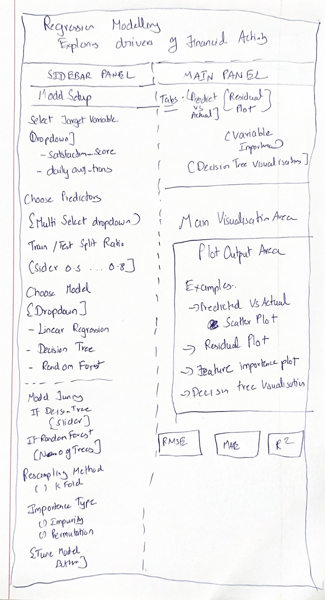

## Overview

This section presents the proposed user interface design for the regression modelling module of the Shiny application. The prototype focuses on supporting predictive analysis of customer financial activity in the Colombian fintech ecosystem.

The UI design is developed as a storyboard rather than a final Shiny implementation. Its purpose is to illustrate the proposed page layout, the major interface components, the analytical outputs to be displayed, and the expected user interactions. The storyboard helps translate the predictive modelling workflow into an interactive visual analytics dashboard.

## Proposed Module

The proposed module is a **Regression Modelling Dashboard** designed to allow users to explore and compare predictive models for customer financial behaviour.

The dashboard supports two target-variable options:

- **Customer Satisfaction**, represented by `satisfaction_score`
- **Customer Transaction Behaviour**, represented by `log_avg_daily_transactions`

This design allows the application to support more than one modelling objective while maintaining a consistent interface structure.

## Storyboard of Proposed UI

Figure 1 shows the hand-drawn storyboard for the proposed Shiny application module.

{fig-align="center" width="100%" fig-cap="Storyboard of the proposed regression modelling dashboard."}

## Overall Layout Design

The proposed dashboard adopts a **three-zone layout**.

### Header Section

The top portion of the interface is reserved for the dashboard title. This helps users immediately understand the purpose of the module and the type of analysis being performed.

The header is designed to display:

- the module title, and
- the modelling context or target variable.

### Sidebar Panel

The left sidebar is used to expose all major input controls required for model building and tuning. This area is intended to support user interaction in a structured and sequential way.

The sidebar is divided into two main sections:

#### Model Setup

This section contains controls for defining the modelling task. The proposed components include:

- a **target variable selector** to allow users to switch between customer satisfaction and transaction behaviour,
- a **predictor selector** to choose which explanatory variables should be included,
- a **train-test split slider** to define the proportion of data used for training,
- a **model selector** to choose between Linear Regression, Decision Tree, and Random Forest, and
- a **Build Model** button to run the selected model.

#### Model Tuning

This section contains model-specific tuning controls that appear depending on the model selected by the user.

For **Decision Tree**, the interface may expose:

- maximum depth,
- minimum split size, and
- an option to use the best cost-complexity parameter.

For **Random Forest**, the interface may expose:

- number of trees,
- resampling method, and
- feature importance type.

A **Tune Model** button is included so that users can apply updated tuning settings.

### Main Panel

The central panel is used to display model results and visual analytics outputs. To avoid clutter, the outputs are organized using a tab-based structure. The proposed tabs include:

- **Model Summary**
- **Predicted vs Actual**
- **Residual Plot**
- **Variable Importance**
- **Decision Tree Visualization**

This structure allows users to switch easily between different diagnostic views without overcrowding a single screen.

### Performance Summary Cards

At the bottom of the dashboard, three metric cards are proposed to summarize key model performance indicators:

- **RMSE**
- **MAE**
- **R-squared**

These cards provide users with an immediate summary of model performance and support quick comparison across modelling approaches.

## Proposed UI Components

The table below summarises the key interface elements and their intended roles in the dashboard.

| UI Component | Purpose |
|---|---|
| `selectInput()` / `pickerInput()` | Allows users to choose the target variable and predictor variables |
| `sliderInput()` | Allows users to adjust the train-test split ratio and tuning parameters |
| `numericInput()` | Allows users to specify the number of trees for Random Forest |
| `radioButtons()` | Allows users to choose resampling method or importance type |
| `actionButton()` | Triggers model fitting and tuning |
| `tabsetPanel()` | Organises multiple analytical outputs into separate tabs |
| `plotOutput()` | Displays scatter plots, residual plots, variable importance charts, and decision tree diagrams |
| `tableOutput()` / `verbatimTextOutput()` | Displays model summaries and tuning results |
| `valueBox()` | Displays RMSE, MAE, and R-squared in summary cards |

## Explanation of User Interaction Flow

The proposed user interaction flow is designed to be intuitive and aligned with the regression modelling workflow.

First, the user selects the target variable and a set of predictors from the sidebar. Next, the user chooses a modelling technique and specifies the train-test split ratio. After clicking the **Build Model** button, the selected model is fitted and the outputs are displayed in the main panel.

If the user selects a tunable model such as Decision Tree or Random Forest, additional tuning controls become available in the tuning section. The user can then adjust these parameters and click **Tune Model** to update the model and its visual outputs.

The tabs in the main panel allow the user to move between diagnostic and interpretive views, while the metric cards at the bottom provide a concise summary of predictive performance.

## UI Design Rationale

The proposed design follows several important visual analytics and dashboard design principles.

First, the separation between the sidebar and the main panel improves usability by distinguishing input controls from analytical outputs. Second, the use of tabs reduces visual clutter and makes the interface easier to navigate. Third, the inclusion of summary metric cards supports rapid performance assessment. Finally, the use of model-specific tuning controls improves flexibility while keeping the interface context-sensitive and user-friendly.

Overall, the design is intended to support both exploration and interpretation, allowing users to compare models and understand the drivers of customer financial activity in a clear and structured way.

## Conclusion

The storyboard presents a dashboard-oriented UI design for the regression modelling module of the proposed Shiny application. It translates the predictive modelling workflow into an interactive structure consisting of a header, sidebar controls, tabbed output panels, and summary metric cards.

This design provides a practical foundation for the later development of the full Shiny application while ensuring that the proposed interface remains aligned with usability, interpretability, and visual analytics principles.