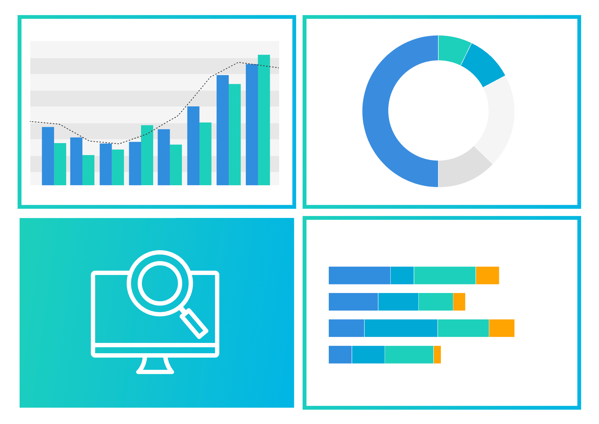

# Visual Analytics Learning Journey

Welcome to my course website for **ISSS608 – Visual Analytics**.

This site documents my learning journey through hands-on exercises, in-class activities, and take-home assignments using R and modern data visualisation tools.

---

## Explore

- Hands-on Exercises  
- In-Class Exercises  
- Take-Home Exercises  
- About  

---

## What You'll Find

- Data visualisation using `ggplot2`
- Exploratory and explanatory analysis
- Visual storytelling techniques
- Real-world dataset applications

---

## About Me

**Gautamgovan**  
MITB (Data Science and Analytics), SMU

Learn more on the [About Page](about.qmd)

---

## Contacts

- **Email:** [gautamgovan@gmail.com](mailto:gautamgovan@gmail.com)  
- **LinkedIn:** [https://www.linkedin.com/in/gautamgovan-e](https://www.linkedin.com/in/gautamgovan-e)

